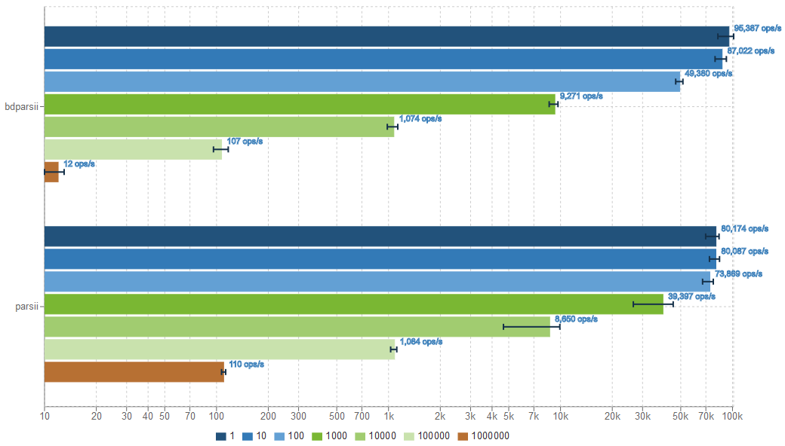

# Performance Test

A small project which performs a comparative performance test between the original parsii library, and the BigDecimal variant bdparsii.

The executed code is

```java
Scope scope = new Scope();
Variable var = scope.create("x");
Expression expr = Parser.parse("2 + (7 - 5) * 3.14159 * x^(12-10) + sin(-3.141)", scope);
for (int x = 1_000_000-iterations; x < 1_000_000; ++x) {
	var.setValue(x);
	expr.evaluate();
}
```

This will test both parsing/compilation of the expression as execution of the given expression. This test is based on the [original performance test](http://andreas.haufler.info/2013/12/how-to-write-one-of-fastest-expression.html) of the parsii library.

## Results

Tested on JDK 1.8.0_102, VM 25.102-b14

[](http://jmh.morethan.io/?gist=8e6607067d9d6cc75d050d683280a447)

```
Benchmark               (iterations)   Mode  Cnt      Score      Error  Units
FullBenchmark.bdparsii             1  thrpt   50  95386.608 ± 1952.588  ops/s
FullBenchmark.bdparsii            10  thrpt   50  87022.418 ± 1780.371  ops/s
FullBenchmark.bdparsii           100  thrpt   50  49380.281 ±  641.951  ops/s
FullBenchmark.bdparsii          1000  thrpt   50   9271.281 ±  128.852  ops/s
FullBenchmark.bdparsii         10000  thrpt   50   1073.630 ±   20.175  ops/s
FullBenchmark.bdparsii        100000  thrpt   50    107.383 ±    2.471  ops/s
FullBenchmark.bdparsii       1000000  thrpt   50     11.929 ±    0.258  ops/s
FullBenchmark.parsii               1  thrpt   50  80174.216 ± 1483.715  ops/s
FullBenchmark.parsii              10  thrpt   50  80086.874 ± 1142.108  ops/s
FullBenchmark.parsii             100  thrpt   50  73869.094 ± 1097.321  ops/s
FullBenchmark.parsii            1000  thrpt   50  39397.175 ± 2807.776  ops/s
FullBenchmark.parsii           10000  thrpt   50   8649.867 ±  480.739  ops/s
FullBenchmark.parsii          100000  thrpt   50   1084.315 ±    9.770  ops/s
FullBenchmark.parsii         1000000  thrpt   50    110.393 ±    0.896  ops/s
``` 

As these results show, performing BigDecimal calculations are slower than double based calculations. 
But if the parsed expression cannot be reused a lot the performance penalty is significantly less.

