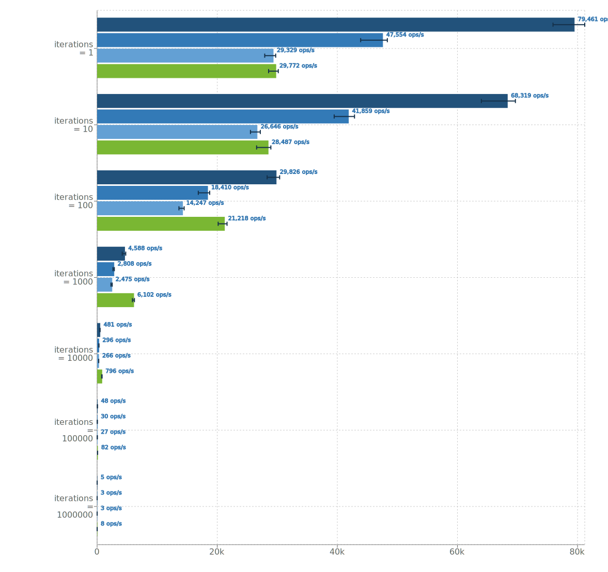
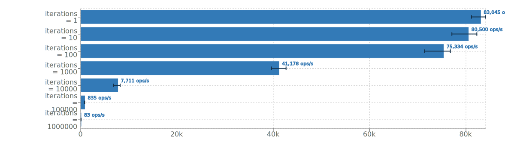

# Performance Test

A small project which performs a comparative performance test between the original parsii library, and the BigDecimal variant bdparsii.

The executed code is

```java
Scope scope = new Scope();
scope.setMathContext(mathcontext); // only for bdparsii
Variable var = scope.create("x");
Expression expr = Parser.parse("2 + (7 - 5) * 3.14159 * x^(12-10) + sin(-3.141)", scope);
for (int x = 1_000_000-iterations; x < 1_000_000; ++x) {
	var.setValue(x);
	expr.evaluate();
}
```

This will test both parsing/compilation of the expression as execution of the given expression. This test is based on the [original performance test](http://andreas.haufler.info/2013/12/how-to-write-one-of-fastest-expression.html) of the parsii library.

## Optimized Expression

Parsii will simplify the above expression as much as possible. The resulting expression which will be executed during `expr.evaluate()` is `1.99941 + 6.28318 * x^2` as the rest has already been evaluated to constants.

## Results

Tested on JDK 1.8.0_102, VM 25.102-b14

**DbParsii**

**Parsii**

[Full Results](http://jmh.morethan.io/?source=https://raw.githubusercontent.com/mpobjects/bdparsii/master/src/test/perftest/src/site/jmh-results.json)

```
Benchmark     (iterations)  (mathContext)   Mode  Cnt      Score     Error  Units
BdParsii.run             1      DECIMAL32  thrpt   50  79460.994 ± 672.434  ops/s
BdParsii.run             1      DECIMAL64  thrpt   50  47553.672 ± 351.739  ops/s
BdParsii.run             1     DECIMAL128  thrpt   50  29329.106 ± 197.162  ops/s
BdParsii.run             1      UNLIMITED  thrpt   50  29772.296 ± 177.296  ops/s
BdParsii.run            10      DECIMAL32  thrpt   50  68319.088 ± 696.285  ops/s
BdParsii.run            10      DECIMAL64  thrpt   50  41858.520 ± 336.723  ops/s
BdParsii.run            10     DECIMAL128  thrpt   50  26645.651 ± 218.029  ops/s
BdParsii.run            10      UNLIMITED  thrpt   50  28486.879 ± 237.865  ops/s
BdParsii.run           100      DECIMAL32  thrpt   50  29826.022 ± 218.464  ops/s
BdParsii.run           100      DECIMAL64  thrpt   50  18410.439 ± 159.023  ops/s
BdParsii.run           100     DECIMAL128  thrpt   50  14246.796 ± 107.520  ops/s
BdParsii.run           100      UNLIMITED  thrpt   50  21217.938 ± 152.603  ops/s
BdParsii.run          1000      DECIMAL32  thrpt   50   4588.383 ±  69.692  ops/s
BdParsii.run          1000      DECIMAL64  thrpt   50   2808.223 ±  27.695  ops/s
BdParsii.run          1000     DECIMAL128  thrpt   50   2474.903 ±  22.553  ops/s
BdParsii.run          1000      UNLIMITED  thrpt   50   6102.212 ±  41.085  ops/s
BdParsii.run         10000      DECIMAL32  thrpt   50    481.395 ±   3.481  ops/s
BdParsii.run         10000      DECIMAL64  thrpt   50    296.237 ±   2.207  ops/s
BdParsii.run         10000     DECIMAL128  thrpt   50    265.686 ±   2.415  ops/s
BdParsii.run         10000      UNLIMITED  thrpt   50    796.020 ±   9.266  ops/s
BdParsii.run        100000      DECIMAL32  thrpt   50     47.832 ±   0.395  ops/s
BdParsii.run        100000      DECIMAL64  thrpt   50     29.998 ±   0.202  ops/s
BdParsii.run        100000     DECIMAL128  thrpt   50     27.432 ±   0.206  ops/s
BdParsii.run        100000      UNLIMITED  thrpt   50     81.581 ±   1.035  ops/s
BdParsii.run       1000000      DECIMAL32  thrpt   50      5.454 ±   0.053  ops/s
BdParsii.run       1000000      DECIMAL64  thrpt   50      2.921 ±   0.034  ops/s
BdParsii.run       1000000     DECIMAL128  thrpt   50      2.859 ±   0.050  ops/s
BdParsii.run       1000000      UNLIMITED  thrpt   50      7.948 ±   0.045  ops/s
Parsii.run               1            N/A  thrpt   50  83044.987 ± 386.330  ops/s
Parsii.run              10            N/A  thrpt   50  80499.569 ± 704.917  ops/s
Parsii.run             100            N/A  thrpt   50  75333.864 ± 654.469  ops/s
Parsii.run            1000            N/A  thrpt   50  41177.726 ± 432.268  ops/s
Parsii.run           10000            N/A  thrpt   50   7710.984 ± 175.995  ops/s
Parsii.run          100000            N/A  thrpt   50    834.514 ±   6.545  ops/s
Parsii.run         1000000            N/A  thrpt   50     83.238 ±   1.582  ops/s
``` 

As these results show, performing BigDecimal calculations are slower than double based calculations.
The performance depends a lot on the chosen MathContext, and used mathematical functions. 
High precisions with complex math perform worse. 
If only basic math (`*/+-%`) is used the unlimited precision will actually perform better because no time is spend on rounding the results to the correct precision.

