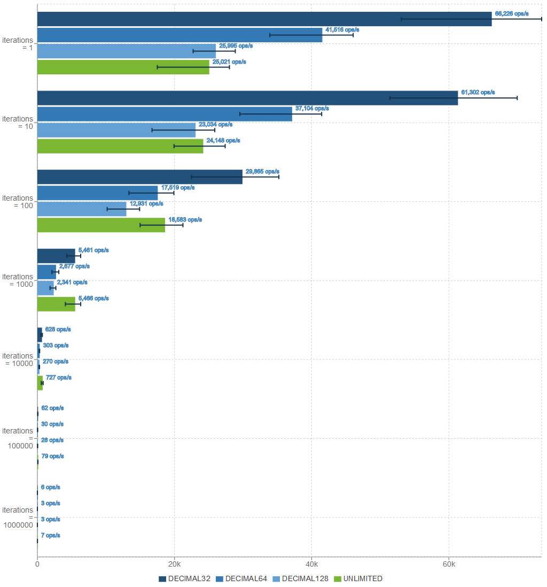
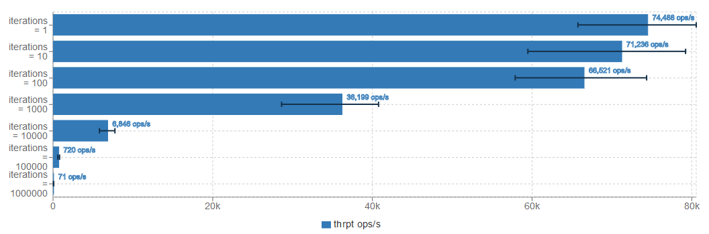

# Performance Test

A small project which performs a comparative performance test between the original parsii library, and the BigDecimal variant bdparsii.

The executed code is

```java
Scope scope = new Scope();
scope.setMathContext(mathcontext); // only for bdparsii
Variable var = scope.create("x");
Expression expr = Parser.parse("2 + (7 - 5) * 3.14159 * x^(12-10) + sin(-3.141)", scope);
for (int x = 1_000_000-iterations; x < 1_000_000; ++x) {
	var.setValue(x);
	expr.evaluate();
}
```

This will test both parsing/compilation of the expression as execution of the given expression. This test is based on the [original performance test](http://andreas.haufler.info/2013/12/how-to-write-one-of-fastest-expression.html) of the parsii library.

## Results

Tested on JDK 1.8.0_102, VM 25.102-b14



[Full Results](http://jmh.morethan.io/?source=https://raw.githubusercontent.com/mpobjects/bdparsii/master/src/test/perftest/src/site/jmh-results.json)

```
Benchmark     (iterations)  (mathContext)   Mode  Cnt      Score      Error  Units
BdParsii.run             1      DECIMAL32  thrpt   50  66226.266 ± 2462.510  ops/s
BdParsii.run             1      DECIMAL64  thrpt   50  41515.960 ± 1327.682  ops/s
BdParsii.run             1     DECIMAL128  thrpt   50  25994.950 ±  760.381  ops/s
BdParsii.run             1      UNLIMITED  thrpt   50  25021.384 ±  987.292  ops/s
BdParsii.run            10      DECIMAL32  thrpt   50  61302.083 ± 2256.868  ops/s
BdParsii.run            10      DECIMAL64  thrpt   50  37104.065 ± 1370.380  ops/s
BdParsii.run            10     DECIMAL128  thrpt   50  23034.369 ±  961.130  ops/s
BdParsii.run            10      UNLIMITED  thrpt   50  24147.860 ±  917.300  ops/s
BdParsii.run           100      DECIMAL32  thrpt   50  29865.121 ± 1387.613  ops/s
BdParsii.run           100      DECIMAL64  thrpt   50  17518.558 ±  715.147  ops/s
BdParsii.run           100     DECIMAL128  thrpt   50  12930.886 ±  464.285  ops/s
BdParsii.run           100      UNLIMITED  thrpt   50  18583.318 ±  717.525  ops/s
BdParsii.run          1000      DECIMAL32  thrpt   50   5461.194 ±  222.383  ops/s
BdParsii.run          1000      DECIMAL64  thrpt   50   2676.773 ±  102.385  ops/s
BdParsii.run          1000     DECIMAL128  thrpt   50   2341.103 ±   91.905  ops/s
BdParsii.run          1000      UNLIMITED  thrpt   50   5466.064 ±  243.679  ops/s
BdParsii.run         10000      DECIMAL32  thrpt   50    627.821 ±   24.447  ops/s
BdParsii.run         10000      DECIMAL64  thrpt   50    302.632 ±    8.916  ops/s
BdParsii.run         10000     DECIMAL128  thrpt   50    270.275 ±   10.661  ops/s
BdParsii.run         10000      UNLIMITED  thrpt   50    726.906 ±   33.218  ops/s
BdParsii.run        100000      DECIMAL32  thrpt   50     62.221 ±    2.079  ops/s
BdParsii.run        100000      DECIMAL64  thrpt   50     30.299 ±    1.085  ops/s
BdParsii.run        100000     DECIMAL128  thrpt   50     27.735 ±    1.090  ops/s
BdParsii.run        100000      UNLIMITED  thrpt   50     78.589 ±    2.470  ops/s
BdParsii.run       1000000      DECIMAL32  thrpt   50      6.080 ±    0.230  ops/s
BdParsii.run       1000000      DECIMAL64  thrpt   50      3.028 ±    0.101  ops/s
BdParsii.run       1000000     DECIMAL128  thrpt   50      2.780 ±    0.093  ops/s
BdParsii.run       1000000      UNLIMITED  thrpt   50      7.003 ±    0.305  ops/s
Parsii.run               1            N/A  thrpt   50  74488.188 ± 1933.882  ops/s
Parsii.run              10            N/A  thrpt   50  71236.055 ± 2520.904  ops/s
Parsii.run             100            N/A  thrpt   50  66520.834 ± 2030.346  ops/s
Parsii.run            1000            N/A  thrpt   50  36198.600 ± 1095.089  ops/s
Parsii.run           10000            N/A  thrpt   50   6845.650 ±  251.867  ops/s
Parsii.run          100000            N/A  thrpt   50    720.350 ±   23.940  ops/s
Parsii.run         1000000            N/A  thrpt   50     71.022 ±    3.264  ops/s
``` 

As these results show, performing BigDecimal calculations are slower than double based calculations.
The performance depends a lot on the chosen MathContext, and used mathematical functions. 
High precisions with complex math perform worse. 
If only basic math (`*/+-%`) is used the unlimited precision will actually perform better because no time is spend on rounding the results to the correct precision.

